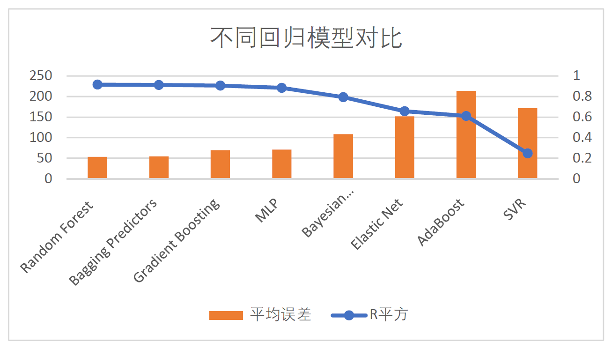

# Data Mining Project:Lianjia House Price Prediction
This repository is established to explore data on [LianJia](https://sh.lianjia.com/), which is a second-hand housing trading platform and covers house info like area size, facing direction, elevator ratio and so on.
Overall, the work in this repo could be summarized in following aspects: 

- Collect the house information using python crawler. 
- Preprocess the data (clean, discretize, match, normalize, etc).
- Conduct feature engineering to analyse the data.
- Apply various classic machine learning algorithms to predict house price.
- Construct BiLSTM model to parse raw describtive text of house and combine it to MLP. 

The documents of our work are available here: [[report]](https://github.com/wangjksjtu/Data-Mining-51Job/blob/master/docs/report.pdf).

## Requirements
- [scrapy](https://scrapy.org/) (web crawling)
- [numpy](http://www.numpy.org/) and [pandas](http://pandas.pydata.org/) (data preprocessing)
- [scikit-learn](http://scikit-learn.org/stable/index.html) (ML-algorithms)
- [matplotlib](https://matplotlib.org/) and [seaborn](https://seaborn.pydata.org/index.html) (data visualization)
- [tensorflow](https://www.tensorflow.org/) (BiLSTM text parsing model)

## QuickStart
### Web Crawling
We use [scrapy](https://scrapy.org/) to crawl raw data from [LianJia](https://sh.lianjia.com/). See the directory ```/code/Crawler_code/``` for codes. XPath is used to parse the html and extract data information.
Below is visualization plot of all house prices:

<figure class="half">
    
</figure>


### Data Preprocessing
We use python libraries [pandas](http://pandas.pydata.org/) (using class dataframe) and re to preprocess the raw data. See /preprocess/preprocess.py for code.
You can find the preprocessed data in /data/csv_after_process/, where intergral_data.csv is well-prepared and used for visualization,
 while final_traning_data.csv for training models.
Check ```/doc/report.pdf ``` to see more preprocess detail.

### Feature Engineering

See directory ```/code/Data_Visualizer```.
 We analyzed feature coorelation and feature distribution respectively. We found 22 features that can play a role in prediction models.


### Classical Model for House Price Prediction

| Model | R2 value | Mean Error | time / s |  
| :---- |:------------:| :----: | :----: |
|Random Forest   | __0.916__   | __53.442__  |  1.695  |
|Bagging Predictors  | 0.913  | 54.143   |  1.693  |
|Gradient Boosting  |  0.907  |  69.277 | 3.626   |
|MLP  | 0.885   | 70.762  |  16.559 |
|Bayesian Interpolation  | 0.795    | 108.579    |  0.157 |
|Elastic Net  | 0.657   | 151.809  |  __0.076__ |
|AdaBoost  | 0.611   | 213.527   | 2.027  |
|SVR  | 0.248  |  172.069   | 128.438   |

The R2 and MSE plot of the above models:
<figure class="half">
    
</figure>


### BiLSTM + MLP Model to additionally parse text data
The overall model structure: 
<figure class="center">
    
</figure>


Train loss and R2 plot for different embedding size: 

 


## Team Members
- [Qingru Zhang](https://github.com/QingruZhang)
- [Juncheng Wan]()
- [Jiajun Du]()
- [Tang Xue]()

